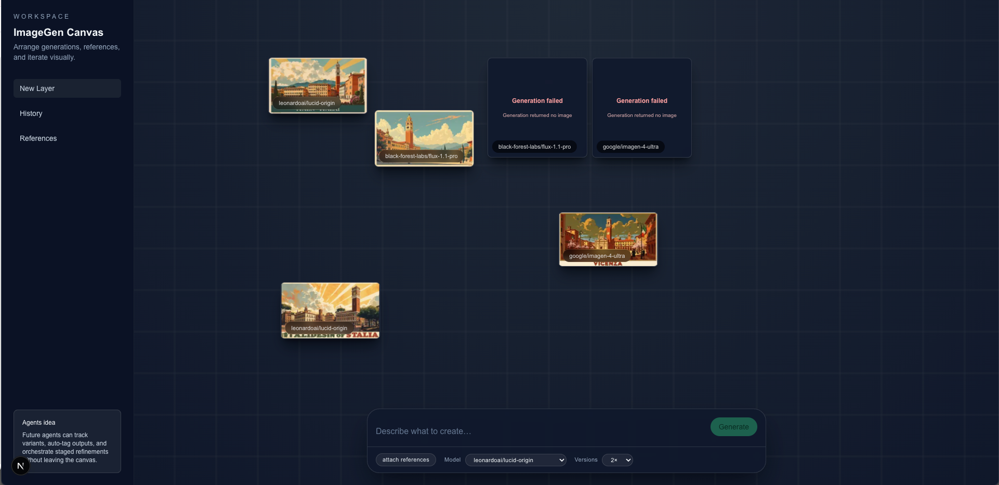

# ImageGen Canvas

An experimental canvas UI for orchestrating AI-assisted image generation. Arrange generations spatially, iterate with prompts, attach reference images, and compare multiple versions on a persistent canvas.



The app uses a collaborative workspace metaphor:

- A left-aligned sidebar for workspace actions.
- A bottom-centered prompt dock for conversational generation.
- A canvas where each generation is a draggable card that keeps the image’s native aspect ratio (no cropping).

## Features

- Draggable image cards on a spatial canvas (`src/components/canvas/`).
- Dynamic card sizing to the image’s aspect ratio (no cropping, scaled to fit a cap).
- Multi-version generation (1–5 outputs per prompt).
- Model selection with sensible per-model defaults (`src/hooks/replicate.ts`).
- Attach one or more reference images; they are sent as base64 data URIs to the model.
- Status UI: pending spinner, error message surfaces.
- Per-card model label overlay.
- Keyboard UX: Enter to submit, Shift+Enter for a new line.

See the evolving roadmap in `agents.md`.

## Quick start

Prereqs:

- Node 18+ (recommended)
- [Bun](https://bun.sh) 1.1+
- A Replicate API token

1) Install deps

```bash
bun install
```

2) Configure environment

Create `.env.local` in the project root with your Replicate token:

```bash
REPLICATE_API_TOKEN=your_replicate_api_token_here
```

3) Run the app

```bash
bun dev
```

Then open http://localhost:3000

## Usage

- Type a prompt in the bottom dock, choose a model and number of versions, then press Enter.
- Optionally attach reference images via “Attach references”.
- New items appear on the canvas slightly offset and are draggable.
- When the image finishes, the card resizes to the native aspect ratio and shows the full image (no cropping). The longest edge is capped for readability.

## Configuration

Models and default inputs are defined in `src/hooks/replicate.ts`:

- `IMAGE_GEN_MODELS`: list of selectable models (e.g. `black-forest-labs/flux-1.1-pro`).
- `MODEL_INPUT_DEFAULTS`: per-model default inputs (e.g. aspect ratio, output format, etc.).

The server-side generation handler lives in `src/hooks/ssr/replicate.ts` and uses the Replicate SDK. Reference files are read and sent as base64 `data:` URLs.

Image delivery is allowed via Next Image configuration in `next.config.ts` (remote patterns for `replicate.com` and `replicate.delivery`).

Card sizing behavior is controlled in `src/components/canvas/item-card.tsx` (`DEFAULT_SIDE` cap). Increase it for larger on-canvas previews.

## Tech stack

- Next.js 15 (App Router)
- React 19
- Tailwind CSS v4
- Replicate Node SDK

## Scripts

```bash
bun dev      # start dev server (Turbopack)
bun run build  # build (Turbopack)
bun start    # run production server
bun run lint   # lint
```

## Deploy

On platforms like Vercel, set `REPLICATE_API_TOKEN` as an environment variable. The existing image remote patterns in `next.config.ts` are compatible with Replicate’s URLs.

## Roadmap / Ideas

See `agents.md` for upcoming ideas such as retrying failed generations, full-resolution preview on hover/eye icon, canvas zoom, right-click item menu, persistence via cloud storage, and client-side settings (e.g. Zustand).

## Troubleshooting

- Blank images: ensure `REPLICATE_API_TOKEN` is set and valid.
- Images not loading: verify `next.config.ts` `images.remotePatterns` and that the URL host matches Replicate.
- 429/limits: Replicate rate limiting may apply; reduce concurrent generations.

